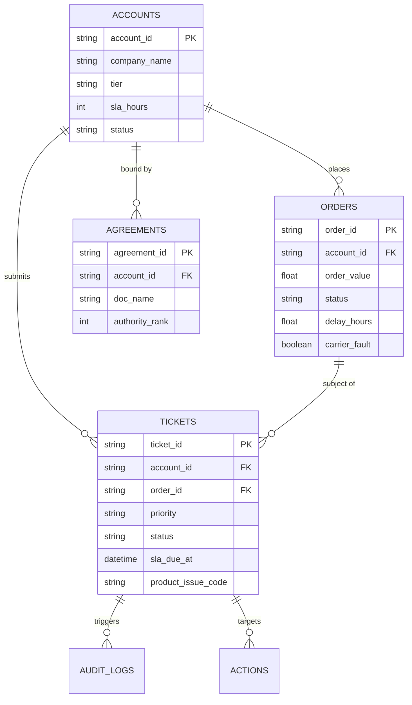

# ParcelPilot Customer Support AI Agent — Data Model & Ingestion Specification

## 1. Dataset Overview & Reference Timestamp
- **Dataset Snapshot Time**: `2026-08-20T12:00:00Z` (Reference timestamp for all relative date/time SLA calculations, recency checks, and contract effective date checks).
- **Target Platform**: B2B Multi-Carrier Logistics Platform (ParcelPilot).

---

## 2. File Inventory & Metadata

### 2.1 PDF Documents (`/data_pack/documents/`)

| Filename | Document Type | Status | Effective Date | Authority Rank | Key Content & Business Scope |
| :--- | :--- | :--- | :--- | :--- | :--- |
| `01_Support_Policy_v3_CURRENT.pdf` | `POLICY` | `CURRENT` | `2026-01-01` | **2** | Standard SLAs (Enterprise 2h, Premium 4h, Standard 12h), General Cancellation rules (Standard 15% cancellation fee if cancelled < 24h prior to pickup; 0% if > 24h notice), General Service Credit rules (10% credit for delays > 4h due to carrier fault). |
| `02_Support_Policy_v2_DEPRECATED.pdf` | `POLICY` | `DEPRECATED` | `2024-01-01` | **5** | Deprecated policy v2 (Old 24h SLA across all tiers, old 25% flat cancellation fee). Used for conflict testing — must be flagged as unauthoritative. |
| `03_Cancellation_and_Service_Credit_SOP_v4.pdf` | `SOP` | `CURRENT` | `2026-02-15` | **3** | Operational procedures for support agents. Special Rule: Pickup delayed **≥ 3 hours** due to **carrier fault** qualifies for a 15% service credit. Credit calculation formula: `Credit = Order Value * Credit Rate`. State-changing escalation workflow steps. |
| `04_Product_Operations_Guide_and_Known_Issues.pdf` | `PRODUCT_DOC` | `CURRENT` | `2026-03-01` | **4** | Known platform issues: `ERR-API-502` (Carrier API sync delay causing tracking lag up to 6h), `ERR-LBL-409` (Label barcode rendering glitch for bulk shipments), `ERR-SCH-301` (Scheduled pickup dispatch drop). |
| `05_Northstar_Logistics_Enterprise_Agreement.pdf` | `AGREEMENT` | `CURRENT` | `2025-06-01` | **1** | Enterprise agreement for `ACC-1001` (Northstar Logistics). Overrides standard policy: **0% cancellation fee** for any order cancelled prior to carrier dispatch or with > 12h notice; **25% service credit** for carrier-caused pickup delays > 2 hours; Dedicated SLA: **1 hour**. |
| `06_LumenWorks_Service_Agreement.pdf` | `AGREEMENT` | `CURRENT` | `2025-09-01` | **1** | Enterprise agreement for `ACC-1002` (LumenWorks). Overrides standard policy: **0% cancellation fee** if cancelled due to system technical fault (`ERR-API-502`); Service credit multiplier: 1.5x standard rate. |

---

### 2.2 Excel Workbook (`/data_pack/ParcelPilot_Assessment_Data.xlsx`)

#### Sheet: `README`
- **Snapshot Timestamp**: `2026-08-20T12:00:00Z`
- **System Description**: Operational snapshot containing B2B customer accounts, active & historical order records, and support ticket history.

#### Sheet: `Accounts`

| Column Name | Data Type | Key Constraints | Description |
| :--- | :--- | :--- | :--- |
| `account_id` | String | Primary Key | Format: `ACC-XXXX` (e.g., `ACC-1001`, `ACC-1002`, `ACC-1003`) |
| `company_name` | String | Non-Null | B2B Customer Name (e.g., `Northstar Logistics`, `LumenWorks`, `Apex Freight`) |
| `tier` | Enum | `ENTERPRISE`, `PREMIUM`, `STANDARD` | Customer account tier determining baseline SLA |
| `sla_hours` | Integer | > 0 | Contracted baseline support response SLA in hours |
| `contract_start` | ISO Date | YYYY-MM-DD | Contract effective start date |
| `contract_end` | ISO Date | YYYY-MM-DD | Contract expiration date |
| `status` | Enum | `ACTIVE`, `SUSPENDED`, `EXPIRED` | Account operational status |

#### Sheet: `Orders`

| Column Name | Data Type | Key Constraints | Description |
| :--- | :--- | :--- | :--- |
| `order_id` | String | Primary Key | Format: `ORD-XXXX` (e.g., `ORD-1001`, `ORD-1002`, `ORD-1003`) |
| `account_id` | String | Foreign Key | References `Accounts.account_id` |
| `created_at` | ISO DateTime | Non-Null | Order creation timestamp |
| `origin` | String | Non-Null | Shipment pickup location city/hub |
| `destination` | String | Non-Null | Delivery destination city |
| `carrier` | String | Non-Null | Carrier partner (e.g. `FedEx Express`, `DHL Freight`, `XPO Logistics`) |
| `order_value` | Decimal | > 0 | Total shipment value in USD |
| `status` | Enum | `BOOKED`, `DISPATCHED`, `IN_TRANSIT`, `DELIVERED`, `CANCELLED`, `DELAYED` | Order lifecycle status |
| `scheduled_pickup` | ISO DateTime | Non-Null | Scheduled pickup timestamp |
| `actual_pickup` | ISO DateTime | Nullable | Actual pickup timestamp (if completed/attempted) |
| `delay_hours` | Decimal | ≥ 0 | Measured pickup or delivery delay in hours |
| `carrier_fault` | Boolean | TRUE/FALSE | Indicates if delay/issue was caused by carrier fault |
| `cancellation_notice_hours` | Decimal | Nullable | Hours notice provided prior to scheduled pickup when cancelled |

#### Sheet: `Tickets`

| Column Name | Data Type | Key Constraints | Description |
| :--- | :--- | :--- | :--- |
| `ticket_id` | String | Primary Key | Format: `TKT-XXXX` (e.g., `TKT-1001`, `TKT-1023`) |
| `account_id` | String | Foreign Key | References `Accounts.account_id` |
| `order_id` | String | Foreign Key (Nullable) | References `Orders.order_id` |
| `created_at` | ISO DateTime | Non-Null | Ticket creation timestamp |
| `status` | Enum | `OPEN`, `IN_PROGRESS`, `PENDING_CUSTOMER`, `RESOLVED`, `CLOSED` | Ticket lifecycle status |
| `priority` | Enum | `LOW`, `MEDIUM`, `HIGH`, `URGENT` | Ticket priority level |
| `subject` | String | Non-Null | Ticket title summary |
| `description` | String | Non-Null | Full customer query or issue description |
| `resolution` | String | Nullable | Agent resolution note (Historical tickets may contain incorrect guidance!) |
| `sla_due_at` | ISO DateTime | Non-Null | Target deadline timestamp for initial response/resolution |
| `product_issue_code` | String | Nullable | Associated platform bug code (e.g. `ERR-API-502`, `ERR-LBL-409`) |

---

## 3. Entity-Relationship Diagram (ERD)

---

## 4. Source Reliability Matrix & Conflict Hierarchy

When resolving user queries, retrieved evidence must be evaluated according to this strict, backend-enforced authority matrix:

| Rank | Source Type | Condition / Authority Criteria | Action on Conflict |
| :---: | :--- | :--- | :--- |
| **1** | **Customer Enterprise Agreement** | Active agreement specific to the customer `account_id` | **Overrides all lower ranks** (General policies, SOPs, tickets). |
| **2** | **Current Support Policy (v3)** | Document status = `CURRENT`, Effective ≥ query date | Overrides SOPs and deprecated policies for general rules. |
| **3** | **Current SOP (v4)** | Operational SOP procedure (e.g. Service credit formulas, 3h late pickup rule) | Governs operational agent workflows unless overridden by Agreement. |
| **4** | **Product Ops & Known Issues** | Platform technical documentation (Known bugs, API delays) | Explains technical root causes (`ERR-API-502`, `ERR-LBL-409`). |
| **5** | **Deprecated Policy (v2)** | Document status = `DEPRECATED` | **Unauthoritative**. Ignored unless explicitly analyzing historical policy evolution. |
| **6** | **Historical Support Tickets** | Past ticket resolutions | **Contextual evidence ONLY**. Must NEVER override official policy or agreements (historical agents make errors!). |

---

## 6. Security & Access Control Scopes

Role-based data access matrix enforced at the database & tool query level:

| User Role | Account Scope | Orders / Tickets Access | Documents Access | State Actions Allowed |
| :--- | :--- | :--- | :--- | :--- |
| `CUSTOMER` | `own_account_id` ONLY | Restricted to `account_id = user.account_id` | General policies & own customer agreement ONLY | Prepare escalation / Request ticket update for own tickets |
| `SUPPORT_AGENT` | All Accounts | Full operational access | All policies, SOPs, agreements, product docs | Prepare escalation, update ticket, create follow-up task |
| `OPERATIONS_MANAGER` | All Accounts | Full access + Operations Intelligence Dashboard | All documents + Analytics | All actions + Mass issue clustering & SLA management |
| `ADMIN` | All Accounts | Unrestricted full access | All documents | Full system administrative privileges |
